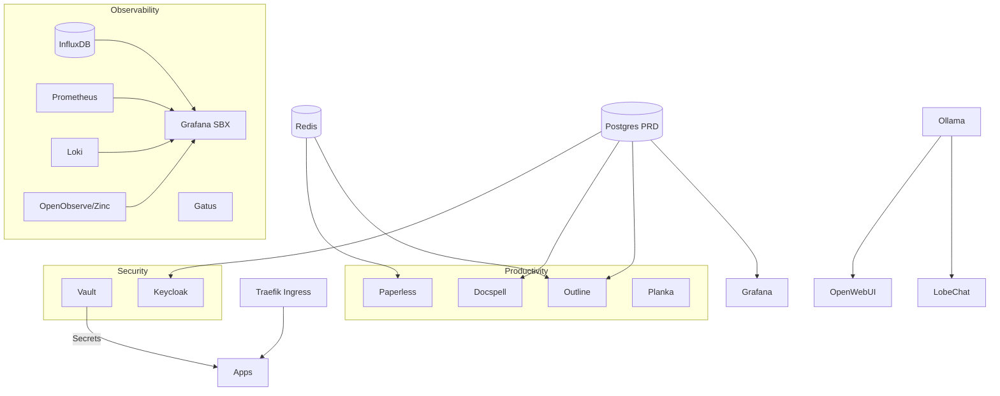

# Architecture

This section details the high-level architecture and service dependencies of the **Jo3** cluster.

## Service Dependency Map

The following diagram illustrates the relationships between the core infrastructure, observability stack, productivity tools, and AI services.

## Infrastructure Components

- **Traefik Ingress**: Entry point for all HTTP/HTTPS traffic.
- **HashiCorp Vault**: Central secret management.
- **PostgreSQL**: Primary relational database for most applications.
- **Redis**: Caching layer for Paperless and Outline.
